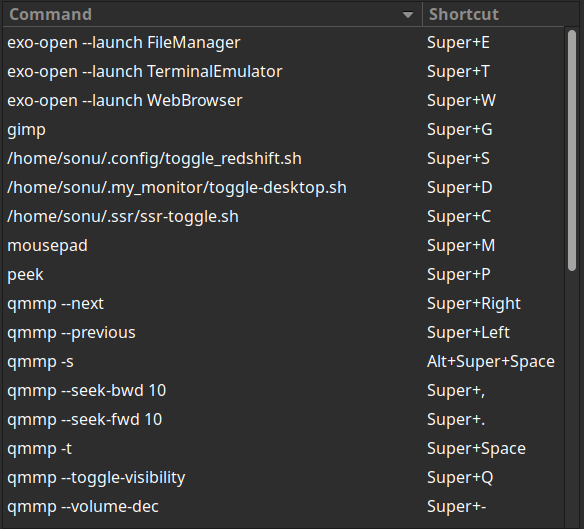
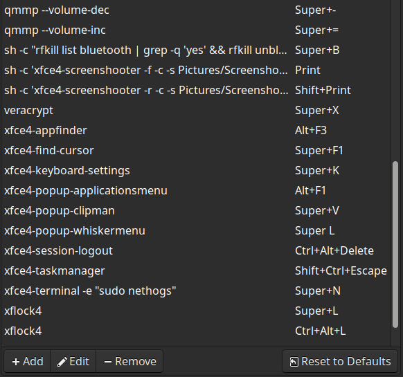
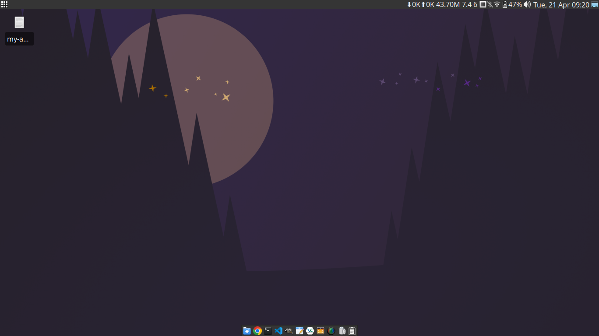
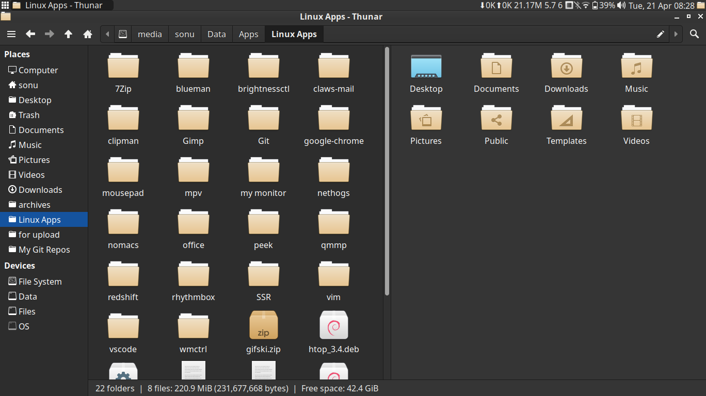
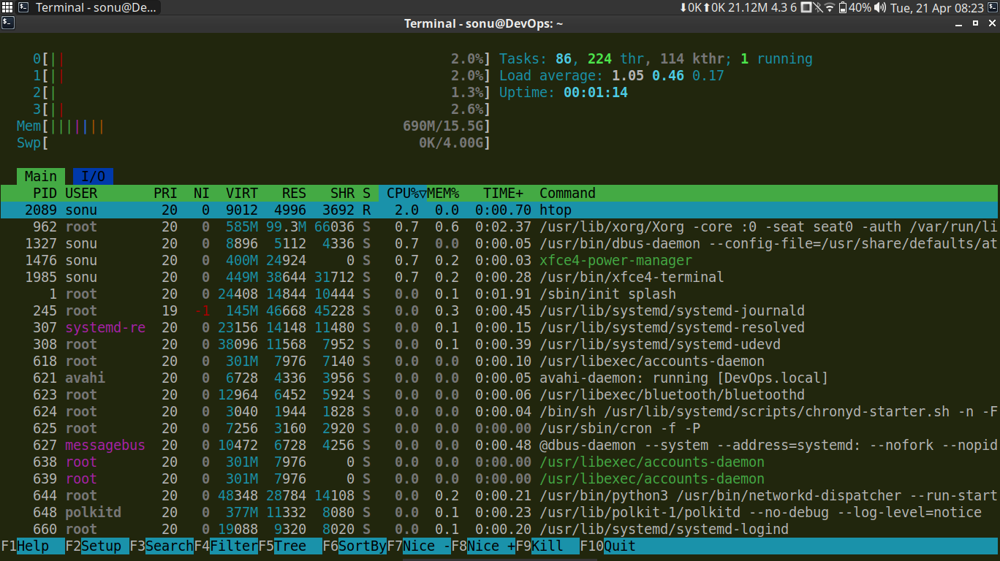
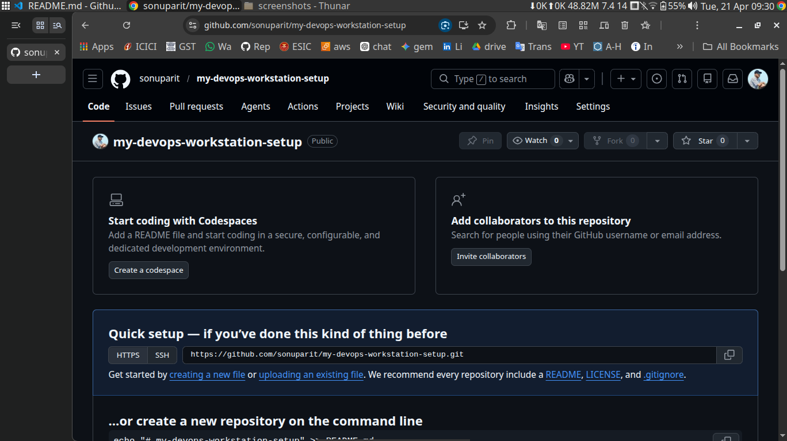
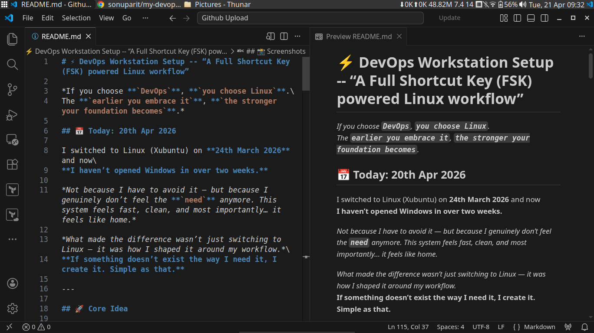
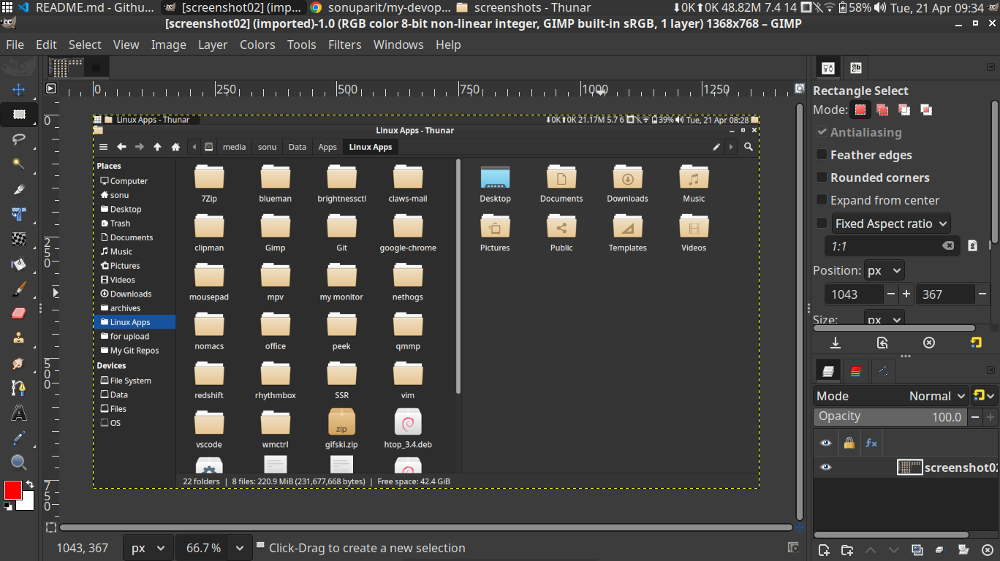
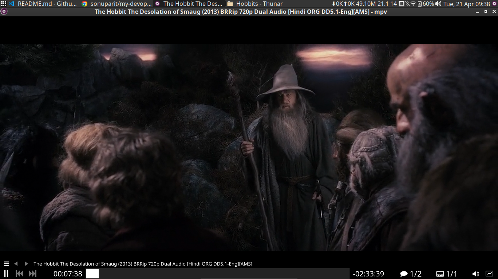
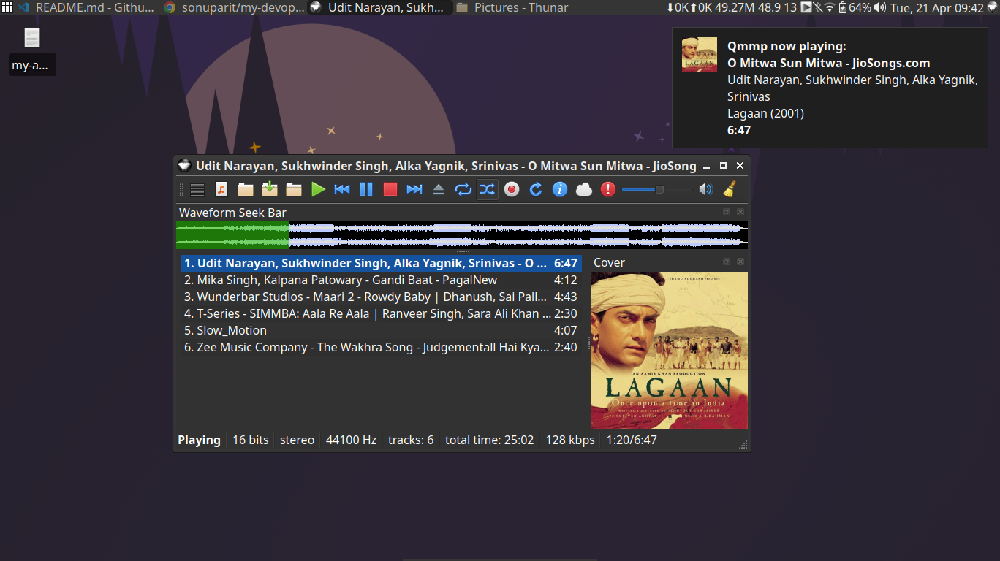

# ⚡ DevOps Workstation Setup -- “A Full Shortcut Key (FSK) powered Linux workflow”

*If you choose **`DevOps`**, **`you choose Linux`**.\
The **`earlier you embrace it`**, **`the stronger your foundation becomes`**.*

## 📅 Today: 20th Apr 2026

I switched from Windows to Linux (Xubuntu) on **24th March 2026** and now\
**I haven’t opened Windows in over two weeks.**

*Not because I have to avoid it — but because I genuinely don’t feel the **`need`** anymore. This system feels fast, clean, and most importantly… it feels like home.*

*What made the difference wasn’t just switching to Linux — it was how I shaped it around my workflow.*\
**If something doesn’t exist the way I need it, I create it. Simple as that.**

## 📑 Table of Contents

- **[Core Idea](#-core-idea)**
- **[Mindset](#-mindset)**
- **[A Lesson That Shaped Me](#-a-lesson-that-shaped-me)**
- **[My Linux Philosophy](#-my-linux-philosophy)**
- **[What I Set Up](#️-what-i-set-up)**
- **[My Take](#-my-take)**
- **[Screenshots](#-screenshots)**
- **[Final Thought](#-final-thought)**

## 🚀 Core Idea

**When you choose DevOps, you choose Linux. Accept it or left behind**

I redesigned my entire workflow using XFCE with one goal:
- **FSK = Full on Shortcut Keys**
- No distractions
- No unnecessary clicks
- Just speed, control, and focus
- Add your own functionality

*Instead of relying on UI-heavy tools, I built:*
- **Shortcut-driven environment**:
- **Everything is just one keypress away.**

------------------------------------------------------------------------

## 🧠 Mindset

This setup is not about tools.  
It’s about **`reducing friction between thought and execution`** — which is critical in a rapidly changing DevOps world.

---

## 📖 A Lesson That Shaped Me

*When Android first launched, I believed Nokia was still the best.*

*In 2012, I bought my first smartphone — **Nokia N96 (16GB)**.*

*Soon after, I discovered Android… especially — **`custom ROMs`**.*

*That moment hit hard.*

*Within a year, I realized I had invested in the past while the future was already here.*

*That lesson changed how I approach technology — and life.*

**Either you evolve with technology — or you get left behind.**

---

## 🐧 My Linux Philosophy

**`If you choose DevOps, you choose Linux.`**

**The earlier you embrace it, the stronger your foundation becomes.**

### What I value most:
- Full customization  
- Fast and responsive  
- Less clicking, more doing  
- Greater control  
- Better focus  

and linux gives it all

---

## ⚙️ What I Set Up

| Windows App              | Linux Alternative        | Shortcut / Notes              |
|--------------------------|--------------------------|-------------------------------|
| Photoshop                | GIMP                     | super + g                     |
| @maxTrayPlayer (FSK)     | Qmmp (FSK)               | FSK                           |
| f.lux                    | redshift                 | super + s                     |
| deskpins                 | Inbuilt (XFCE)           | alt + space                   |
| Notepad, pnotes          | Mousepad                 | super + m                     |
| MPC-HC                   | mpv                      | FSK (UI-less feel)            |
| Office-2007-portable     | AbiWord, Evince, Gnumeric| —                             |
| Filmora                  | Kdenlive                 | —                             |
| Traffic monitor          | monitor.sh [(vew here)](https://github.com/sonuparit/custom-system-monitor)      | custom script                 |
| Clipboard (win + .)      | Clipman                  | super + v                     |
| StartAllBack             | XFCE Panel               | full customization            |
| Show Desktop             | wmctrl                   | switch (super+d)              |
| Terminal (Windows CMD)   | XFCE Terminal (bash)     | favorite 🔥                   |
| Many more........        |                          |                               |

### Everything I do, almost has a shortcut key:

------------------------------------------------------------------------

## 💭 My Take

Linux didn’t just replace my tools —  
**it matches with how I think, work, and execute.**

------------------------------------------------------------------------

## 📸 Screenshots

------------------------------------------------------------------------

## 🔥 Final Thought

**You don’t need a powerful system.**

You need:
- **Clarity in your workflow**
- **The ability to adapt**  

For me:\
**Linux feels natural — like it understands how I want to work.**\
**On Windows, I was always trying to adjust myself to the system.**

**When you choose DevOps, you're choosing Linux as well — so it makes sense to switch early.**

Always remember:\
**Your choices either help you evolve with technology — or leave you behind.**

And as for me,\
**`I chose Linux because I want to evolve.`**
